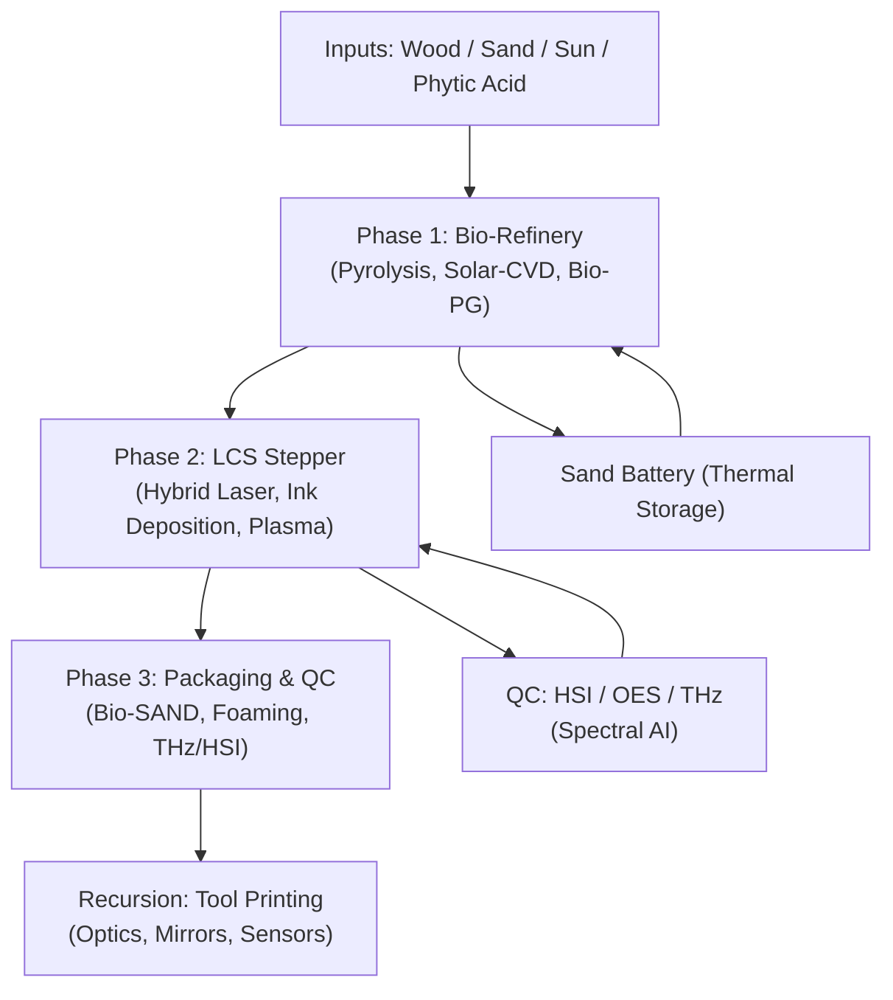
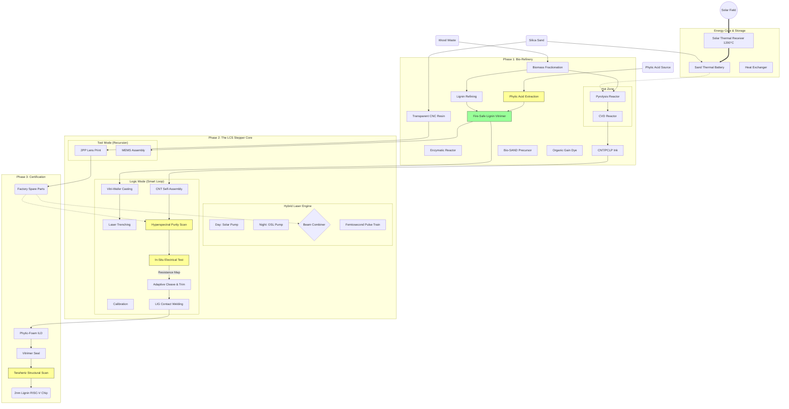
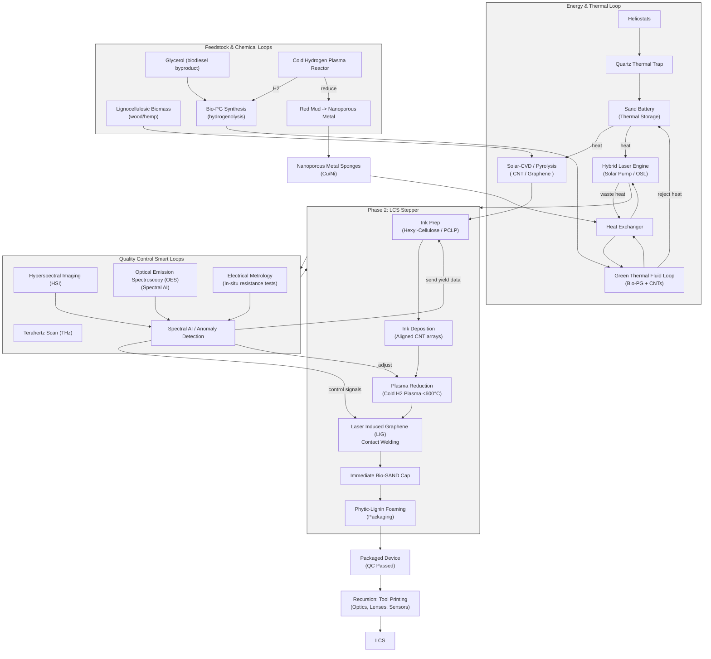

# Synergistic Process for Fabricating Carbon-Based Electronic and Photonic Components

This document outlines a holistic manufacturing process that synthesizes recent findings on graphene, carbon nanotubes (CNTs), and sustainable fabrication methods. The goal is to establish a closed-loop, low-toxicity pipeline for high-performance logic and power devices.

## Phase 0: Hybrid Energy Core (Optional)
**Concept:** Decouple manufacturing from grid instability and fossil fuels.
*   **Thermal Storage:** A **Sand Thermal Battery** heated by concentrated solar power to 1200°C provides 24/7 process heat. **Heliostats** focus sunlight into a **Quartz Thermal Trap** receiver, minimizing re-radiation losses and maximizing efficiency.
*   **Hybrid Laser Engine:** Switches between direct **Solar Pumping** (Day) and **Organic Laser Diode (OSL)** pumping (Night) to drive the lithography systems without interruption.
    *   *Role of GSA:* A **Graphene Saturable Absorber (GSA)** is critical here to passively mode-lock the continuous-wave solar input into the high-peak-power femtosecond pulses required for cold ablation, enabling direct solar-to-laser conversion without electrical transduction.
*   **Active Cooling:** The high-power laser systems utilize a **Green Thermal Fluid** (Bio-Propylene Glycol + Lignin-stabilized CNTs + possibly Phytic acid) for efficient heat rejection, replacing toxic ethylene glycol.

## Phase 1: Sustainable Feedstock & Synthesis
**Concept:** Shift from extractive mining (silicon/copper) to atmospheric harvesting.
*   **Source:** On-site Carbon Capture utilization. CO2 is harvested and converted directly into carbon allotropes (Graphene and CNTs) at the fab site.
*   **Benefit:** Eliminates raw material transport costs and supply chain constraints (e.g., sand purity, neon shortages).

## Phase 1.5: The Pulse Forge
**Concept:** High-flux nucleation for rapid CNT growth.
*   **Protocol:** "Bast Pulse"
*   **Mechanism:** High current (>1.0 A/cm²) capacitor discharge through the catalyst bed.
*   **Effect:** Creates a dense, instantaneous nucleation burst, overriding slower thermal growth modes. This results in aligned, high-purity CNT forests suitable for harvesting.
*   **Energy Source:** Direct coupling with the **Sand Thermal Battery**'s electric output (via thermoelectrics or steam turbines) to charge the pulse capacitor bank.

## Phase 2: The Green Ink
**Concept:** A non-toxic, distinct semiconductor ink formulation.
*   **Solvent:** **Lignin Vitrimer Monomers**. Unlike traditional harsh solvents (NMP, DMF), these monomers (vanillin-derivatives + fatty acid crosslinkers) stabilize the solution and eventually cure into the final substrate/insulator.
*   **Active Agent (The Semi-Con):** **Hexyl-Cellulose** wrapped Carbon Nanotubes.
    *   *Function:* The alkylated cellulose selectively wraps semiconducting CNTs, shedding metallic ones.
    *   *Compatibility:* Hexyl-cellulose is soluble in the lignin monomer blend, creating a uniform "active ink."
*   **Processing:**
    *   *Filtration:* The solution is centrifuged to remove metallic tubes and excess catalyst.
    *   *Deposition:* Inkjet or slot-die coating deposits the active channel material.
*   **Benefits:**
    *   **Safety:** Zero volatile organic compounds (VOCs) if cured properly. The solvent *becomes* the structural plastic.
    *   **Sustainability:** All components are bio-derived (Wood pulp -> Cellulose/Lignin).

## Phase 3: Device Fabrication (LCS Trim)
**Concept:** A unified lithography and alignment process.
*   **Substrate Choice:** **Lignin-Vitrimer** composite. (Recyclable, rigid, and bio-based).
*   **Alignment Methods:**
    *   **Primary (Field Alignment):** An AC electric field (10 V/µm, ~1 MHz) is applied across the liquid ink film. The dielectrophoretic force aligns the semiconducting CNTs parallel to the channel direction.
    *   **Secondary (Shear Alignment):** For higher throughput on less critical features, **Fluid Shear** generated during slot-die coating physically drags the CNTs into alignment parallel to the print direction.
*   **Locking (Vitrimer Set):** Briefly heat or UV-cure the lignin vitrimer matrix *while the field is active*. This locks the aligned tubes in place.
*   **Patterning (The "Trim"):** Use the Hybrid Laser Engine for direct-write ablation (LCS: Laser Crop/Cull/Strip).
    *   *Source:* Optionally driven by direct **Solar Pumping** (via GSA mode-locking) to bypass electrical conversion losses during daylight hours.
    *   *Holographic Projector:* Replaces standard LCoS (which degrades under high power) with an **rGO-Vitrimer Metasurface**. This "Metasurface Voxel E-Ink" acts as a rugged Spatial Light Modulator (SLM) for massively parallel maskless lithography.
    *   *Crop:* Define the channel dimensions (length ~12nm to 1µm).
    *   *Cull:* Selectively ablate regions with metallic contamination (identified by HSI/conductivity mapping).
    *   *Strip:* Remove the polymer wrapper at contact points to lower contact resistance.
*   **Doping:**
    *   *P-Type:* The intrinsic Carbon/Oxygen functional groups often provide p-behavior.
    *   *N-Type:* Use **Potassium (K)** or **Viologens** (salt-free organic n-dopants) printed via inkjet into the source/drain regions.

## Phase 4: Logic & Quantum Architecture
**Concept:** High-performance architecture leveraging carbon's thermal and electrical superiority, supporting both classical and quantum modalities.

### Logic Core (The "Pine-Tree" CPU)
*   **Architecture:** **RISC-V (Reduced Instruction Set Computer)** strictly optimized for the high-frequency capabilities of graphene/CNT transistors.
*   **Goal:** Monolithic integration of logic and memory on a sustainable lignin substrate. This is the facility's primary commercial output.

### Quantum Core (QPU)
*   **Structure:** **Star-Shaped Topology**.
    *   **Ancilla (Hub):** A central qubit acts as the gateway for entanglement and error correction (syndrome measurements).
    *   **Data Leaves:** 6-8 data qubits surround the ancilla spoke-style, allowing high-weight parity checks (LDPC Codes) to run in a single cycle.
*   **Connectivity (Vertical Vias):** **Nitrogenated Lignin-Vitrimer (N-LIG)** stacks form the 3D scaffold.
    *   *Mechanism:* Dynamic vitrimer welding creates vertical vias between layers without solder.
*   **Soliton Bus Architecture:**
    *   **Concept:** Uses **Solitons** (self-reinforcing wave packets) to eliminate signal dispersion at room temperature.
    *   **Bus Fab & Material:** **CO2 Laser Scribing** on **Lignin-Urea** substrate creates **N-LIG (Nitrogen-doped Laser Induced Graphene)** rails. These are loaded with periodic **CNT-Varactors** printed via inkjet.
    *   **Transistor Count:** Ultra-low complexity; each "Soliton Repeater" cell uses only **2 CNT-FETs** acting as varactors.
    *   **Throughput:** Enables **10 GHz+** clock rates on resistive carbon tracks, overcoming the "smearing" limit of standard pulses.
*   **Multiplexing:**
    *   **WDM (Wavelength Division Multiplexing):** Different "colors" of light address different depths of the stack.
    *   **OAM (Orbital Angular Momentum):** Imparts "twist" to the photons, allowing multiple signal modes to travel down the same ancilla waveguide simultaneously (Layer Coding).

## Phase 5: Interconnects
**Concept:** Strategies for on-chip wiring and global signal routing.
*   **Option A (Standard Data): Laser Induced Graphene (LIG).**
    *   The Hybrid Laser Engine efficiently converts the lignin substrate itself into conductive graphene tracks. This is the standard method for classical on-chip data buses.
*   **Option B (Quantum/Optical): Nitrogenated Lignin Waveguides.**
    *   Utilizes the refractive index contrast of the N-LIG material to guide photons for QPU readout and entanglement distribution.
*   **Option C (High-Power): The Zebra Ribbon (Optional).**
    *   *Use Case:* Specialized power delivery or external IO where high ampacity is required.
    *   *Structure:* Recycled **Aluminum Core** (DC Power) + **CNT Skin** (AC Data/RF) + **Lignin Insulation**.
    *   *Note:* Requires "Green Forge" implementation.

### Thermal Management: The "Knowledge-Cooling" Paradigm
**Concept:** Turning Quantum Error Correction (QEC) from a thermal liability into a thermodynamic asset.
*   **Physics:** Leveraging **Landauer’s Erasure Principle** in the quantum regime.
    *   *Standard Limit:* Erasing a bit generates heat ($k_B T \ln 2$).
    *   *Quantum Exception:* If the observer (control system) holds "quantum knowledge" (entanglement) of the system being erased, the conditional entropy can be negative.
*   **Mechanism (Entropy-Siphon):**
    *   **Phase A:** The central Ancilla Hub entangles with its Data Leaves during the parity check.
    *   **Phase B:** The **Soliton Bus** reads the syndrome, transferring "knowledge" to the classical controller.
    *   **Phase C (Cooling):** value-added "Knowledge-Assisted Deletion" is triggered. Instead of dissipating heat, the erasure process **absorbs phonons** from the local Lignin-Vitrimer lattice to satisfy the thermodynamic balance.
*   **Benefit:** The chip effectively acts as its own **dilution refrigerator at the gate level**.
    *   *Impact:* Drastically reduces the external cooling load. The delete cycle actively cools the quantum core, allowing the "Moat" architecture to handle the remaining heat.
    *   *Result:* Massive scaling limits (1e9 qubits) become viable without requiring a building-sized cryostat.

## Phase 6: Packaging & Preservation (The "Phytic Shield")
**Concept:** Sustainable encapsulation that provides UV protection, fire safety, and physical durability.
*   **Material:** **Foamed Lignin Vitrimer** enriched with **Phytic Acid** (derived from seeds/bran).
*   **UV Protection:** Lignin is a natural broad-spectrum UV blocker. A thin coating applied at the fab stage protects the light-sensitive PCLP-wrapped nanotubes from stray UV radiation during processing and storage.
*   **Fire Safety (The "Char Cage"):** Phytic acid acts as a potent flame retardant. In the event of a fire, it crosslinks the lignin into a dense, intumescent char. This "cage" physically traps the carbon nanotubes, preventing the release of hazardous airborne particulates (HARN).
*   **Validation:** Use **Terahertz (THz) Scanning** to non-destructively verify the structural integrity and density of the foam seal without opening the package.

## v6.3: Pine-Tree Foundry — Solar-Powered Monolithic Lignin Fab
**Executive Summary:**
*   Converts **Wood Waste, Sand, and Sunlight** into RISC logic devices and infrastructure using an integrated biorefinery and a sand thermal battery.
*   Adds **Phytic Acid** as a flame-retardant/hardener to the lignin vitrimer resin, ensuring char-lock containment of CNTs in a fire.
*   Integrates the **Sand Battery**, **Hybrid Laser Engine (GSA-locked femtosecond pulses)**, **LCS Stepper**, and closed-loop QC (HSI, OES, THz) with recursion for in-fab tool printing.

### Key Inputs
*   Lignocellulosic biomass (wood waste, hemp) — carbon feedstock, resin, PCLP
*   Solar energy via heliostats → Quartz Thermal Trap
*   Silica sand (thermal storage)
*   Phytic acid (seed/bran) for flame-retardant char formation

### High-level Process Flow
1.  **Phase 1 — Bio-Refinery:** Solar pyrolysis and Solar-CVD convert biomass into CNTs/graphene; glycerol hydrogenolysis yields Bio-PG using hydrogen from the plasma loop.
2.  **Phase 2 — LCS Stepper (Foundry):** Nanoimprinting / maskless lithography driven by the Hybrid Laser Engine; ink deposition, PCLP wrapping, selective plasma reduction, and LIG contact welding.
3.  **Phase 3 — Packaging & QC:** Immediate Bio-SAND capping, foamed phytic-lignin encapsulation, THz structural scan, and HSI/electrical metrology verification.
4.  **Recursion:** Idle capacity prints replacement optics, lenses, and spare components for factory resilience.

### Safety & Yield Highlights
*   **Wet-to-Solid Containment:** CNTs remain solvated (PCLP/ink) until hermetic Bio-SAND encapsulation inside the LCS tool — no dry CNT dust stages.
*   **Phytic Acid Char Cage:** Ensures dense char formation and traps CNTs if a thermal event occurs.
*   **Spectral AI / OES:** Real-time plasma control prevents over-reduction and lattice damage, improving yield.

### Process Overview

(This v6.3 section consolidates v6.1 and earlier elements: Sand Battery, Hybrid Laser Engine, Smart QC loops, and the Phytic Acid safety addition.)

### v6.3 Process Diagram
This diagram adds the **Phytic Acid** input stream and solidifies the integrated QC loops.

### v6.3 Benefits

1.  **Safety:** The **Phytic Acid** addition answers the bio-hazard question. If the chip burns, the CNTs are locked in char.

2.  **Yield:** The **HSI + Electrical Metrology** loop answers the "Crooked Tube" question. The machine corrects defects in real-time.

3.  **Resilience:** The **Sand Battery + Hybrid Laser** answers the "Nighttime" question. The factory never sleeps.

4.  **Cost:** The **Recursion (Tool Printing)** answers the "Depreciation" question. The factory costs essentially nothing to maintain once built.

### v6.3 Expanded Process Diagram (Detailed)

## Conclusion
This synergistic process addresses the primary hurdles of carbon electronics—bandgap engineering, purity, and toxicity—by combining chemical sorting, plasma-based doping, and biodegradable substrates. The result is a path toward "Green" high-performance computing that decouples technological progress from environmental degradation.
