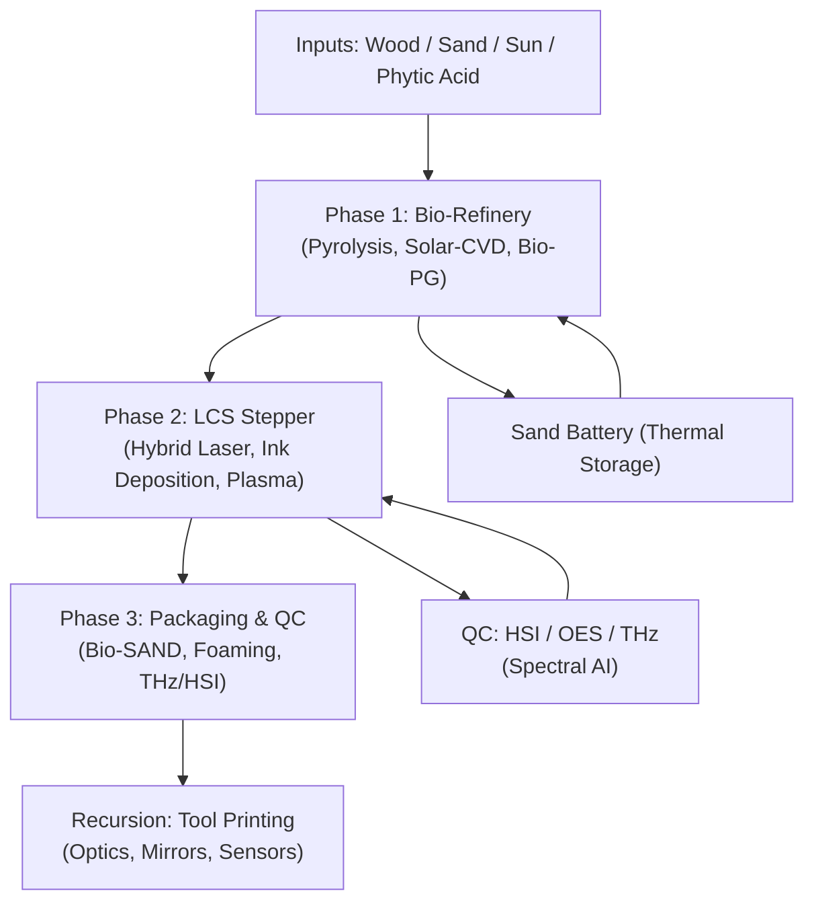
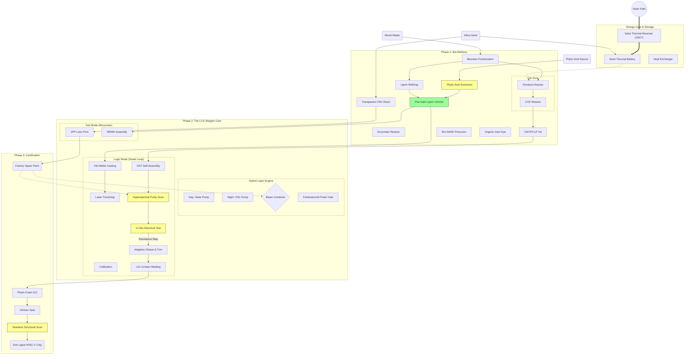
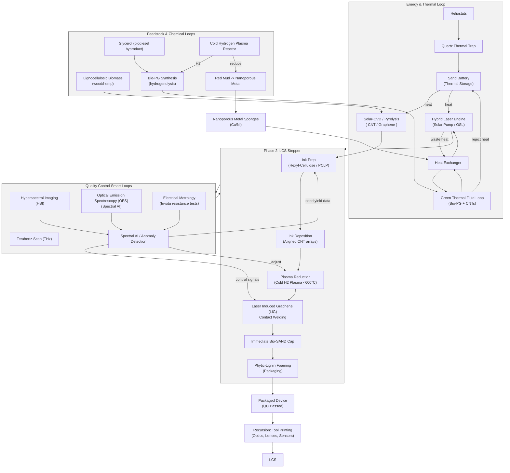

# Synergistic Process for Fabricating Carbon-Based Electronic and Photonic Components

This document outlines a holistic manufacturing process that synthesizes recent findings on graphene, carbon nanotubes (CNTs), and sustainable fabrication methods. The goal is to establish a closed-loop, low-toxicity pipeline for high-performance logic and power devices.

## Phase 0: Hybrid Energy Core (Optional)
**Concept:** Decouple manufacturing from grid instability and fossil fuels.
*   **Thermal Storage:** A **Sand Thermal Battery** heated by concentrated solar power to 1200°C provides 24/7 process heat. **Heliostats** focus sunlight into a **Quartz Thermal Trap** receiver, minimizing re-radiation losses and maximizing efficiency.
*   **Hybrid Laser Engine:** Switches between direct **Solar Pumping** (Day) and **Organic Laser Diode (OSL)** pumping (Night) to drive the lithography systems without interruption, utilizing a **Graphene Saturable Absorber (GSA)** to lock the femtosecond pulses.
*   **Active Cooling:** The high-power laser systems utilize a **Green Thermal Fluid** (Bio-Propylene Glycol + Lignin-stabilized CNTs + possibly Phytic acid) for efficient heat rejection, replacing toxic ethylene glycol.

## Phase 1: Sustainable Feedstock & Synthesis
**Concept:** Shift from extractive mining (silicon/copper) to atmospheric harvesting.
*   **Source:** On-site Carbon Capture utilization. CO2 is harvested and converted directly into carbon allotropes (Graphene and CNTs) at the fab site.
*   **Benefit:** Eliminates raw material transport costs and supply chain constraints (e.g., sand purity, neon shortages).

## Phase 2: Material Processing & Safety (The "Ink")
**Concept:** Mitigate toxicity and ensure electronic purity through liquid-phase processing.
*   **Safety Strategy:** To prevent inhalation risks associated with High Aspect Ratio Nanomaterials (HARN), all nanomaterials are processed via **liquid-phase exfoliation**. This keeps particulates out of the air.
*   **Semiconductor Sorting (The Bandgap Solution):**
    *   *Challenge:* Raw CNTs are a mix of metallic and semiconducting tubes.
    *   *Solution:* Use **Hexyl-Cellulose** (a sustainable alternative to rigid, helical conjugated polymers like PFO-BPy or P3HT, or DNA base proteins) to selectively wrap and isolate semiconducting CNTs.
    *   *Advanced Option:* **Photo-Cleavable Lignin Polymer (PCLP)** enables **DUV lithography** compatibility. This avoids the charred residue from Hexyl-Cellulose annealing (LCS), but introduces a risk of UV degradation instead.
    *   *Note:* Avoid disordered polymers like lignin vitrimers for active logic, as their amorphous nature creates scattering sites that degrade transistor performance.
*   **Green Solvents & Fluids (The "Bio-PG" Loop):**
    *   **Synthesis:** **Bio-Propylene Glycol (Bio-PG)** is synthesized via the **hydrogenolysis of glycerol** (a byproduct of biodiesel production) over a copper catalyst.
    *   **Synergy:** The hydrogen required for this reaction is harvested from the same **Cold Hydrogen Plasma** system used in Phase 3, creating a closed chemical loop.
*   **Doping Precursors:** Utilize **Graphene Oxide (GO)** as a base material. Its oxygen functional groups naturally provide p-type doping.

## Phase 3: Device Fabrication & Bandgap Engineering
**Concept:** Additive manufacturing on sustainable substrates.
*   **Substrates:** Replace non-degradable FR4/Silicon with biodegradable alternatives such as **Cellulose Nanofibrils (CNF)**, **Silk Fibroin**, or water-soluble **phosphate glass**.
*   **Patterning:** Utilize **Nanoimprinting** and **Maskless Lithography** to reduce chemical waste compared to traditional subtractive etching.
*   **Junction Formation (Logic & Rectifiers):**
    *   **Graphene P-N Junctions:** Create rectifiers by starting with a p-type Graphene Oxide sheet. Use a physical mask and **Cold Hydrogen Plasma (<600°C)** to selectively reduce specific regions without thermal damage to the substrate. These reduced regions (rGO) become n-type (or less p-type), forming a seamless p-n junction within a single atomic layer.
    *   **CNT Transistors:** Deposit the polymer-sorted semiconducting CNTs in aligned arrays to form the channel of Field Effect Transistors (FETs).
*   **Integrated Quality Control (The "Smart Loop"):**
    *   **Spectral AI (OES):** Real-time **Optical Emission Spectroscopy** monitors the plasma species (H, OH, CO) during doping. This feedback loop adjusts the RF power and gas flow millisecond-by-millisecond to ensure perfect stoichiometry, preventing over-reduction or damage to the carbon lattice.
    *   **Hyperspectral Imaging (HSI):** Scans deposited layers for chemical impurities in real-time.
    *   **In-Situ Metrology:** Measures the electrical resistance of trench arrays immediately after deposition.
    *   **Adaptive Cleave:** The laser system uses this feedback to selectively trim defective tubes or photo-cleave the PCLP wrapper only on functional sites, maximizing yield.

## Phase 4: Integration & Architecture
**Concept:** High-performance architecture leveraging carbon's thermal and electrical superiority.
*   **Logic Core:** Implement a **RISC (Reduced Instruction Set Computer) Architecture** specifically optimized for the high-frequency capabilities of graphene/CNT transistors.
*   **Interconnects & Power:** Two competing strategies for on-chip wiring:
    *   **Option A: Metallic CNTs/Twisted SWCNTs.** *Advantage:* Ballistic transport and extremely high ampacity (current carrying capacity). *Disadvantage:* Requires precise sorting and placement.
    *   **Option B: Laser Induced Graphene (LIG).** The laser "welds" the lignin substrate itself, converting it into conductive graphene tracks. *Advantage:* Eliminates external material inputs and simplifies the process (monolithic integration). *Disadvantage:* Higher resistance and lower current density compared to pure metallic CNTs.

## Thermal Management Strategy
**Concept:** Handling the extreme power density of carbon electronics.
*   **Interface Material:** Use **Vertically Aligned Carbon Nanotube (VACNT)** arrays as the Thermal Interface Material (TIM). These "forests" provide a ballistic thermal path from the chip to the heat sink, replacing silicone/silver pastes.
*   **Primary Solution (All-Carbon):** Integrate **Graphene Heat Spreaders** directly into the package. Graphene's in-plane thermal conductivity (>3000 W/mK) efficiently moves heat away from hotspots.
*   **Advanced Option (Green Forge Synergy):** If a "Green Forge" facility is available to process Red Mud, **Nanoporous Metal Sponges** (Copper/Nickel) can be utilized. Created via **Cold Hydrogen Plasma**, these sponges are bonded using **Spinduction** (Spin-Induction).
    *   *Process:* The sponge is spun at high RPM within an induction coil. The centrifugal force drives molten alloy deep into the nanopores while the induction field selectively heats the interface, creating a monolithic, void-free bond with massive surface area for phase-change cooling.

## Phase 5: Packaging & Preservation (The "Phytic Shield")
**Concept:** Sustainable encapsulation that provides UV protection, fire safety, and physical durability.
*   **Material:** **Foamed Lignin Vitrimer** enriched with **Phytic Acid** (derived from seeds/bran).
*   **UV Protection:** Lignin is a natural broad-spectrum UV blocker. A thin coating applied at the fab stage protects the light-sensitive PCLP-wrapped nanotubes from stray UV radiation during processing and storage.
*   **Fire Safety (The "Char Cage"):** Phytic acid acts as a potent flame retardant. In the event of a fire, it crosslinks the lignin into a dense, intumescent char. This "cage" physically traps the carbon nanotubes, preventing the release of hazardous airborne particulates (HARN).
*   **Validation:** Use **Terahertz (THz) Scanning** to non-destructively verify the structural integrity and density of the foam seal without opening the package.

## v6.3: Pine-Tree Foundry — Solar-Powered Monolithic Lignin Fab
**Executive Summary:**
*   Converts **Wood Waste, Sand, and Sunlight** into RISC logic devices and infrastructure using an integrated biorefinery and a sand thermal battery.
*   Adds **Phytic Acid** as a flame-retardant/hardener to the lignin vitrimer resin, ensuring char-lock containment of CNTs in a fire.
*   Integrates the **Sand Battery**, **Hybrid Laser Engine (GSA-locked femtosecond pulses)**, **LCS Stepper**, and closed-loop QC (HSI, OES, THz) with recursion for in-fab tool printing.

### Key Inputs
*   Lignocellulosic biomass (wood waste, hemp) — carbon feedstock, resin, PCLP
*   Solar energy via heliostats → Quartz Thermal Trap
*   Silica sand (thermal storage)
*   Phytic acid (seed/bran) for flame-retardant char formation

### High-level Process Flow
1.  **Phase 1 — Bio-Refinery:** Solar pyrolysis and Solar-CVD convert biomass into CNTs/graphene; glycerol hydrogenolysis yields Bio-PG using hydrogen from the plasma loop.
2.  **Phase 2 — LCS Stepper (Foundry):** Nanoimprinting / maskless lithography driven by the Hybrid Laser Engine; ink deposition, PCLP wrapping, selective plasma reduction, and LIG contact welding.
3.  **Phase 3 — Packaging & QC:** Immediate Bio-SAND capping, foamed phytic-lignin encapsulation, THz structural scan, and HSI/electrical metrology verification.
4.  **Recursion:** Idle capacity prints replacement optics, lenses, and spare components for factory resilience.

### Safety & Yield Highlights
*   **Wet-to-Solid Containment:** CNTs remain solvated (PCLP/ink) until hermetic Bio-SAND encapsulation inside the LCS tool — no dry CNT dust stages.
*   **Phytic Acid Char Cage:** Ensures dense char formation and traps CNTs if a thermal event occurs.
*   **Spectral AI / OES:** Real-time plasma control prevents over-reduction and lattice damage, improving yield.

### Process Overview

(This v6.3 section consolidates v6.1 and earlier elements: Sand Battery, Hybrid Laser Engine, Smart QC loops, and the Phytic Acid safety addition.)

### v6.3 Process Diagram
This diagram adds the **Phytic Acid** input stream and solidifies the integrated QC loops.

### v6.3 Benefits

1.  **Safety:** The **Phytic Acid** addition answers the bio-hazard question. If the chip burns, the CNTs are locked in char.
    
2.  **Yield:** The **HSI + Electrical Metrology** loop answers the "Crooked Tube" question. The machine corrects defects in real-time.
    
3.  **Resilience:** The **Sand Battery + Hybrid Laser** answers the "Nighttime" question. The factory never sleeps.
    
4.  **Cost:** The **Recursion (Tool Printing)** answers the "Depreciation" question. The factory costs essentially nothing to maintain once built.

### v6.3 Expanded Process Diagram (Detailed)

## Conclusion
This synergistic process addresses the primary hurdles of carbon electronics—bandgap engineering, purity, and toxicity—by combining chemical sorting, plasma-based doping, and biodegradable substrates. The result is a path toward "Green" high-performance computing that decouples technological progress from environmental degradation.
